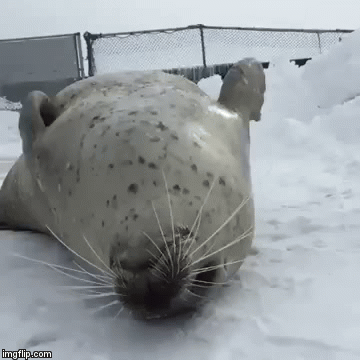

# Обо мне
### Привет! Меня зовут Андрей, мне 24 года и я занимаюсь веб-разработкой.
### Контакты
<a href="facebook.com/Cabagemage" </>
 
## Мой стак
### Backend
- Express.js 
- MONGO.DB 
### Frontend
- React.JS + Redux
- JavaScript 
- HTML5 
- CSS3
- SCSS
- Немного опыта во Vue.

## Ключевые работы 
1. Turbina -  командный проект для НКО, книжного магазина "Маршак". Идея проекта состоит в объединении детского и взрослого творчества. 
Представленные аудиозаписи в проекте являются тестовыми.  
Выполнен при использовании React.JS, CSS3(Flex)
Над проектом работали: Андрей Зайцев (https://github.com/Cabagemage), Екатерина Костина (https://github.com/katekostina) и Сергей Компаниец(https://github.com/DelightVLG)
Ссылка на репозиторий: https://github.com/Cabagemage/turbina-app
Ссылка на проект: https://cabagemage.github.io/turbina-app/

2. News - учебный fullstack проект, позволяющий искать новости при помощи подключения к news-api. При авторизации появляется возможность сохранять эти новости в свой профиль. Сайт является полностью адаптивным.
Frontend: React.JS, Redux, CSS3(Flex/Grid сетки).
Backend: Express.JS, Mongo.db 
Ссылка на репозиторий проекта: https://github.com/Cabagemage/News-Frontend 
Ссылка на проект: https://news-explorer-proj.herokuapp.com/ 

#### 
## Мое состояние после завершения очередного проекта: 

<!--
**Cabagemage/Cabagemage** is a ✨ _special_ ✨ repository because its `README.md` (this file) appears on your GitHub profile.

Here are some ideas to get you started:

- 🔭 I’m currently working on ...
- 🌱 I’m currently learning ...
- 👯 I’m looking to collaborate on ...
- 🤔 I’m looking for help with ...
- 💬 Ask me about ...
- 📫 How to reach me: ...
- 😄 Pronouns: ...
- ⚡ Fun fact: ...
-->
